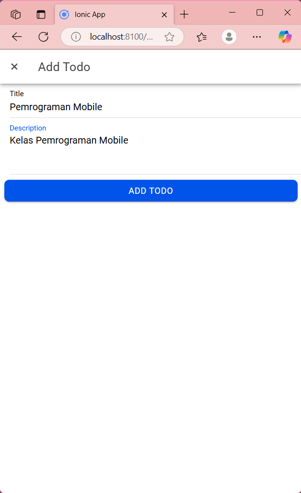

# Secrinshoot
Halaman awal

Halaman Masuk akun google

Halaman Home

Halaman Profile

Halaman Home sebelum di tambah 

Halaman Home ditambah 

Halaman Home setelah ditambah

Hapus

Edit

Setelah diedit

Tampilan Completed

Tampilan Hp

# Penjelasan
1. Konfigurasi Firebase
- Proyek dihubungkan dengan Firebase melalui file firebase.ts di dalam folder utils. File ini berisi konfigurasi Firebase dengan kunci API, domain otentikasi, ID proyek, dll.
- Untuk autentikasi, digunakan GoogleAuthProvider dari Firebase untuk mengautentikasi pengguna melalui akun Google.
2. Proses Autentikasi Login
- Fungsi loginWithGoogle menginisialisasi GoogleAuth dengan clientId serta meminta akses ke profil dan email pengguna.
- Pengguna kemudian masuk menggunakan Google, dan idToken yang diperoleh dari login Google digunakan untuk membuat kredensial dengan GoogleAuthProvider.credential(idToken).
- Kredensial ini digunakan untuk masuk ke Firebase Authentication menggunakan signInWithCredential(). Setelah autentikasi berhasil, objek pengguna (result.user) diperoleh dan disimpan dalam state (user.value).
3. Menampilkan Data Profil Pengguna
- Informasi pengguna seperti displayName (nama tampilan) dan email diambil dari objek user yang disimpan. Foto profil (photoURL) juga dapat diakses dari properti user.
- Halaman profil menampilkan data ini menggunakan ion-input yang diisi dengan data pengguna, dan elemen gambar (ion-avatar) menampilkan foto profil pengguna.
4. Navigasi dan Pengamanan Rute
- Sebelum mengakses rute tertentu seperti /home dan /profile, status autentikasi pengguna diperiksa. Jika pengguna belum login, mereka diarahkan ke halaman login.
- Jika pengguna sudah login dan mencoba mengakses halaman login, mereka akan diarahkan ke halaman beranda (/home).

# Langkah-langkah Build Ionic ke bentuk Apk
1. Buka project Ionic di Visual studio code
2. Masuk ke terminal, ketikkan npm install @capacitor/android
3. Jika sudah selesai, ketikkan npx cap add android
4. Jika sudah selesai, ketikkan npx cap open android
5. Jika sudah selesai semua otomatis akan di alihkan ke aplikasi Android Studio, dan di android studio klik : Build -> Build App Bundle(s) / APK (s) -> Build APK (s)
6. Jika instal sudah selesai, salin file .apk dan kirim ke Handphone, dan jalankan file nya di HP.
7. Selesai, maka tampilan akan sama seperti tampilan yang berada di laptop.
